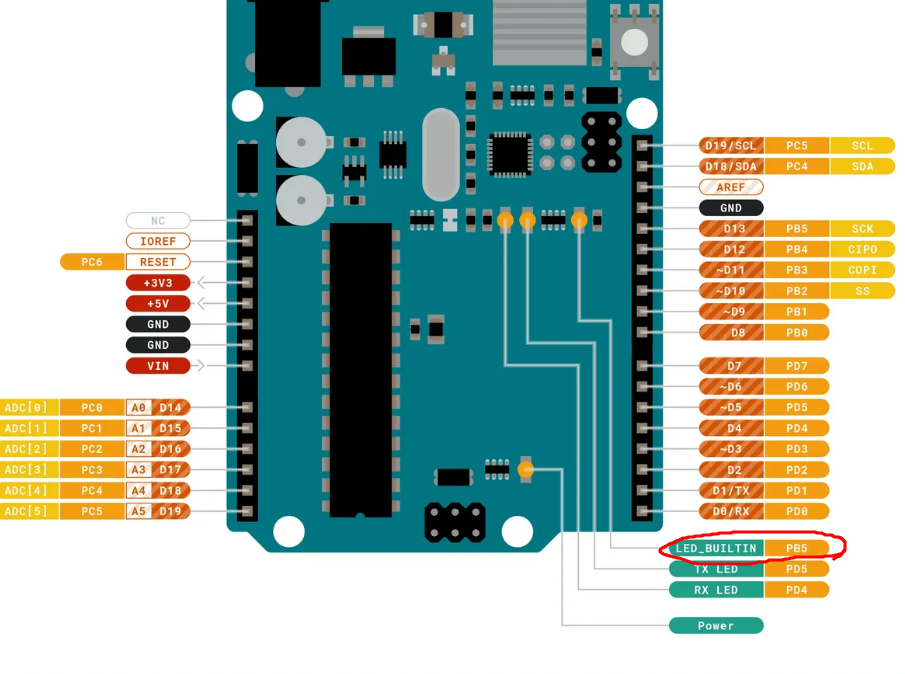
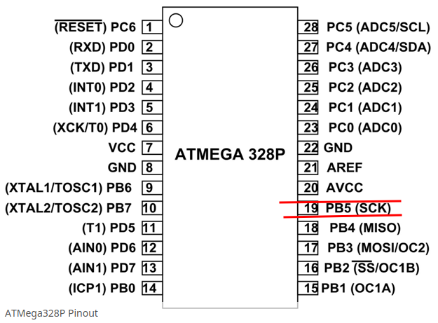
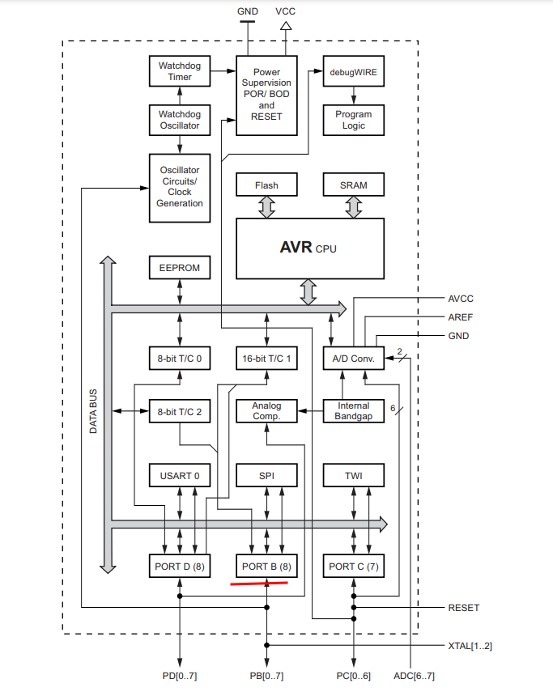
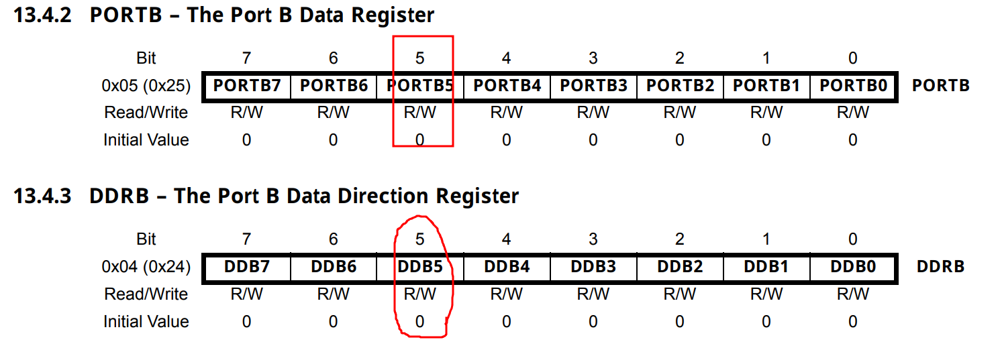

### Bare Metal

##### blink led





```
as you can see the built in led is connected to PB5
so we need some how to set PB5
what is PB5 when you are dealing with MCUs al of the
data in and out is done on what is called ports
ports are just registers on the MCU that are connected
to a set of pins for example PB9 is connected to pin 19
on arduino board
```

**so how do we write data to portb 5**



```
if we want to set pin 5 HIGH and we need first to make
sure that pin 5 is output here comes ddrb
```
